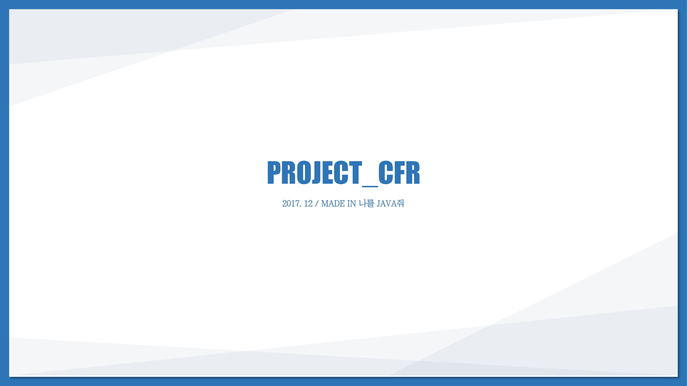
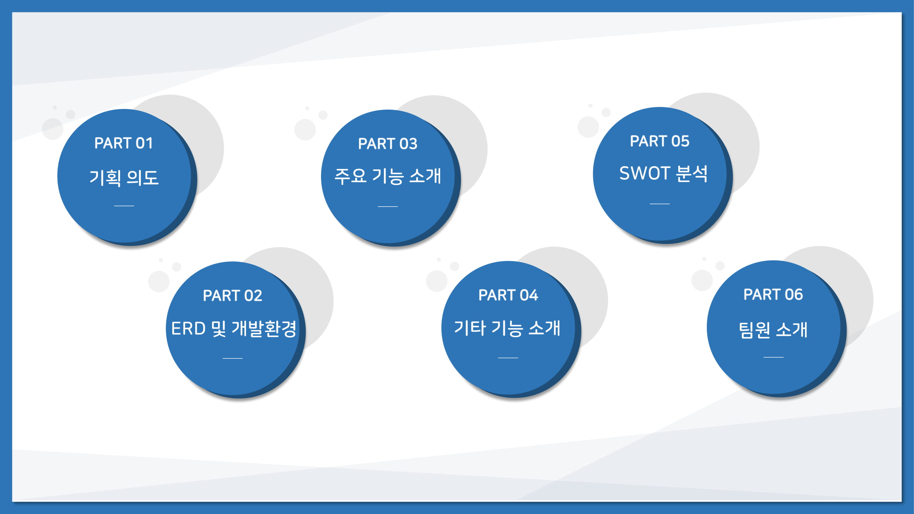
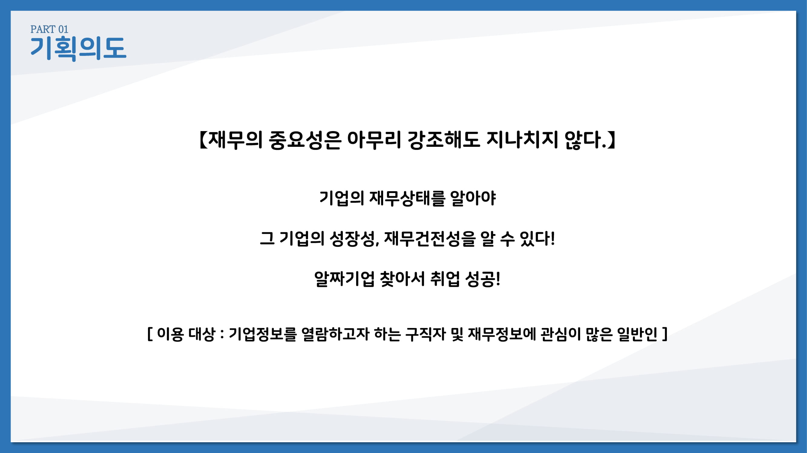
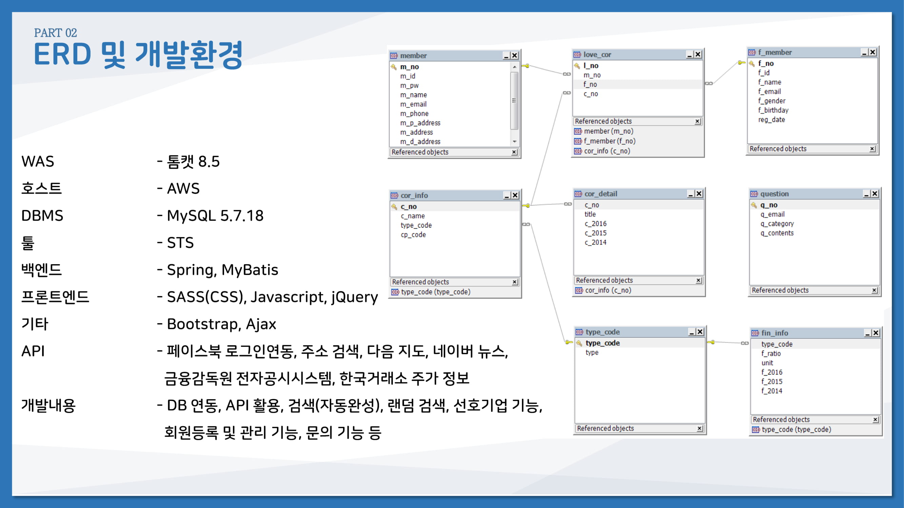
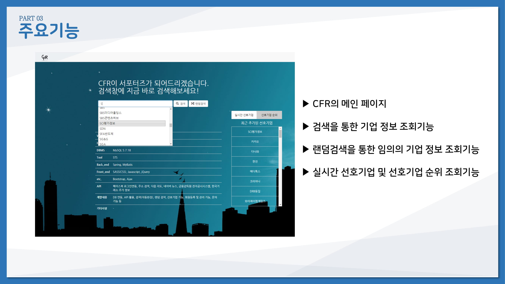
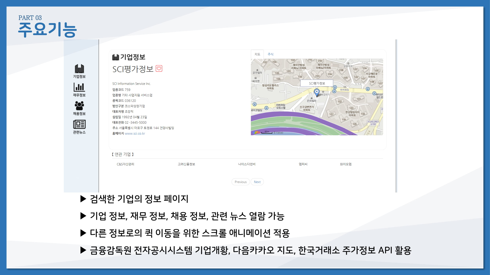
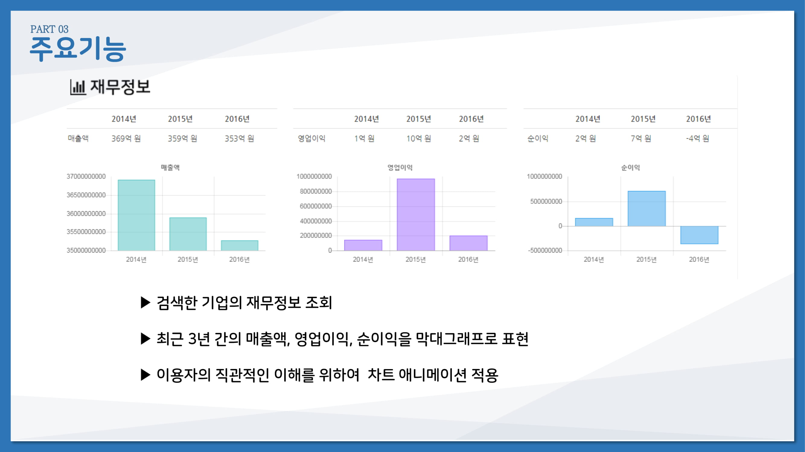
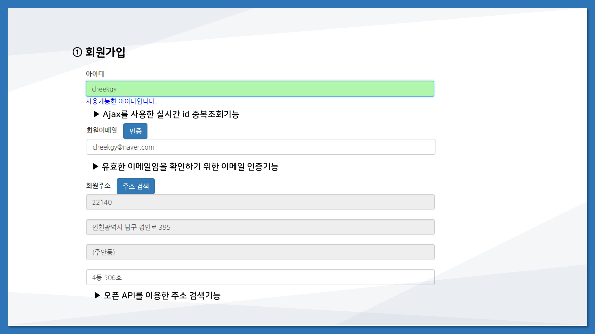
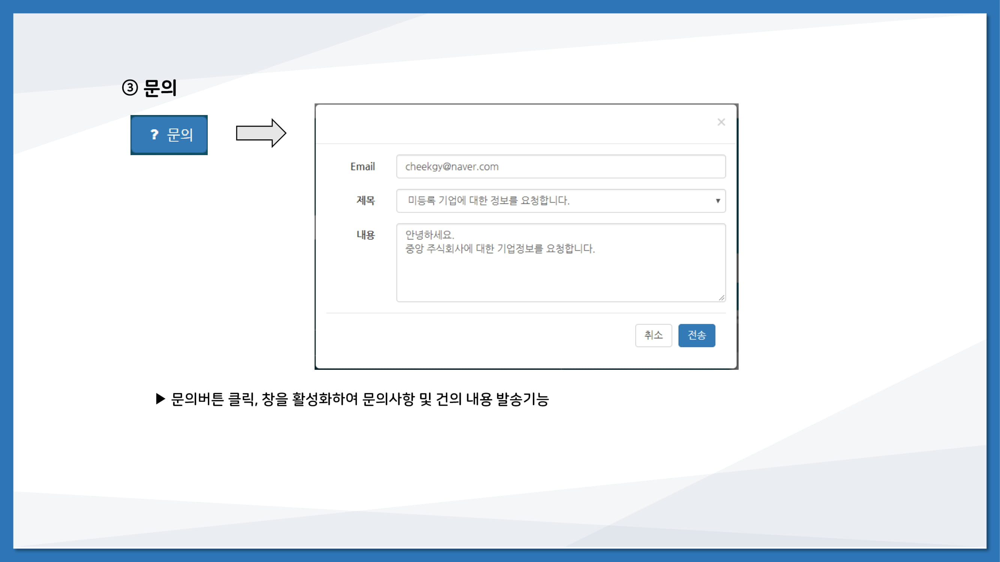

기업 분석 웹어플리케이션
이 프로젝트의 목표는 상장기업들이 공시한 재무제표의 데이터를 기초로 하여 이용자 에게 재무정보를 제공하는 것
첫번째 팀프로젝트
-2017.12월

기업 재무데이터를 가져와 DB에 넣어줌
API를 사용하여 제무정보 가공
그래프로 출력
기타 페이스북 로그인api, google maps api

공공 api로 여러 정보를 수집하여 필요에 맞게 가공하여 다시 제공

포트폴리오(2017.12)

